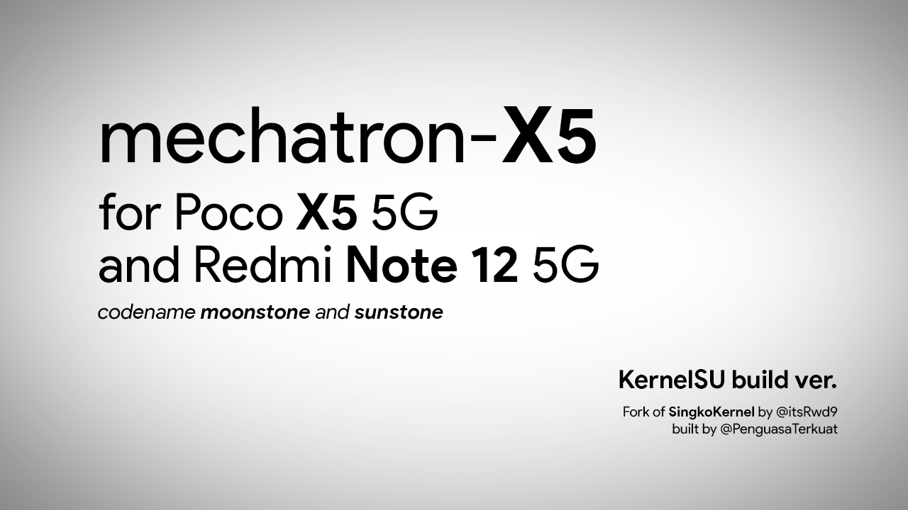

# Mechatron X5 Kernel

For Xiaomi Poco X5 5G and Redmi Note 12 5G

codenamed Moonstone and Sunstone

forked from [SingkoLab](https://github.com/SingkoLab/kernel_xiaomi_stone) Kernel by [@nullptr03](https://github.com/nullptr03)

## Reason to build
- nothing, just a hobby to fill my empty time to build this kernel

## Releases
- not yet, me still experimenting somethings with this new kernel tree
